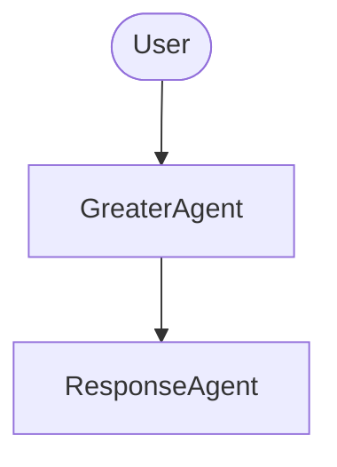
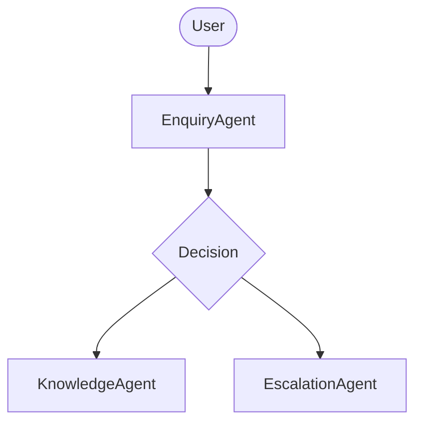

# Hello World

A proejct to learn about AI agents and their interactions.

## AI Agents

### GreaterAgent and ResponseAgent

Receives a greeting request and generates a response.

### EnquiryAgent, KnowledgeAgent, and EscalationAgent

Receives a request and determines if it is simple or hard.\
When it is simple, it generates a response using the KnowledgeAgent.\
When it is hard, it generates a response using the EscalationAgent.

